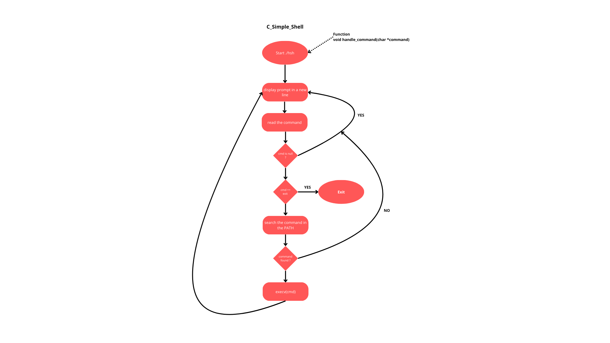

# holbertonschool-simple_shell

## Appendix

We can read the original man page of bash shell here :

```bash
	man bash
```

we can compile the project using this command line in this way :

```bash
	gcc -Wall -Werror -Wextra -pedantic -std=gnu89 *.c -o hsh
```

you can run the project this way in interractive mode :

```bash
	./hsh
```

or in this way in non interractive mode (where command is a shell command as ls or pwd as exemple) :

```bash
	echo command | ./hsh
```

## Requirements :

All our files should end with a new line, with a maximum of 5 functions per file and 40 lines per function.
All your files will be compiled on Ubuntu 20.04 LTS.

### Autorized functions and system calls

#### -all functions from string.h

#### -access (man 2 access)

#### -chdir (man 2 chdir)

#### -close (man 2 close)

#### -closedir (man 3 closedir)

#### -execve (man 2 execve)

#### -exit (man 3 exit)

#### -\_exit (man 2 \_exit)

#### -fflush (man 3 fflush)

#### -fork (man 2 fork)

#### -free (man 3 free)

#### -getcwd (man 3 getcwd)

#### -getline (man 3 getline)

#### -getpid (man 2 getpid)

#### -isatty (man 3 isatty)

#### -kill (man 2 kill)

#### -malloc (man 3 malloc)

#### -open (man 2 open)

#### -opendir (man 3 opendir)

#### -perror (man 3 perror)

#### -printf (man 3 printf)

#### -fprintf (man 3 fprintf)

#### -vfprintf (man 3 vfprintf)

#### -sprintf (man 3 sprintf)

#### -putchar (man 3 putchar)

#### -read (man 2 read)

#### -eaddir (man 3 readdir)

#### -signal (man 2 signal)

#### -stat (\_\_xstat) (man 2 stat)

#### -lstat (\_\_lxstat) (man 2 lstat)

#### -fstat (\_\_fxstat) (man 2 fstat)

#### -strtok (man 3 strtok)

#### -wait (man 2 wait)

#### -waitpid (man 2 waitpid)

#### -wait3 (man 2 wait3)

#### -wait4 (man 2 wait4)

#### -write (man 2 write)

## File list :

Here are the main project files :

### 1. `main.c`

This file is the final code to execute the simple shell.

### 2. `main.h`

The header file, it contains the declarations and prototypes of all our functions.

### 3. `exec_cmd.c`

This file contains function execute the command we write in our simple shell.

### 3. `exec_multiple_cmd.c`

This file is for multiple command given to the simple shell, it splits every of them and execute them one by one.

### 4. `_getenv.c`

This file get the environnement variable.

### 5. `_strtok_r.c`

This file is our rewritten strtok function.

### 6. `path.c`

Functions in this file are searching our written command in the PATH.

### 7. `string_functions.c`

Functions in this file are rewritten simple string functions.

### 8. `subfunction.c`

In this file we can find some little sub-function used to make the shell work correctly.

## Project goal :

In this project, we developed a simplified shell. It can execute commands by providing a direct path, such as `/bin/ls` or simply by entering a command like `ls` which it locates using the PATH environment variable. The shell operates in both interactive and non-interactive modes. It supports single-argument commands and can be closed using the exit command or the CTRL + C shortcut.

## Flowchart :



## Run Locally

Clone the project

```bash
	git clone https://github.com/Gromuf/holbertonschool-simple_shell.git
```

Go to the project directory

```bash
	cd holbertonschool-simple_shell
```

## Compilation GCC :

```bash
	gcc -Wall -Werror -Wextra -pedantic -std=gnu89 *.c -o hsh
```

## Verification of Betty style and Betty doc:

```bash
  betty <file.c>
```

If you want more informations and install Betty linter: https://github.com/hs-hq/Betty

```bash
  git clone  https://github.com/hs-hq/Betty
```

## Support:

For support, email 9540@holbertonstudents.com or 9546@holbertonstudents.com or join our Slack channel on Holberton School.
This code is write with _Visual Studio Code software_ https://code.visualstudio.com/download and _vim_ on sandbox.

# Hi, We are Louis and Stéphane! 👋

## 🛠 Skills:

shell, C...

## 🚀 About us

We are junior developers...

## Authors:

- [@Gromuf](https://www.github.com/Gromuf)
- [@SDINAHET](https://www.github.com/SDINAHET)

## Appendix:

Any additional information goes here
Secret of printf:
https://intranet.hbtn.io/rltoken/xVFYmqhB09g6odagWE5n_w

Flowcharts:
https://intranet.hbtn.io/concepts/895

Approaching a Project:
https://intranet.hbtn.io/concepts/881

Group Projects:
https://intranet.hbtn.io/concepts/893

Pair Programming - How To:
https://intranet.hbtn.io/concepts/894
